# Workspace Filesystem & Sync Architecture

A browser-based, collaborative filesystem backing a Python-in-the-browser
platform. Design goals, in priority order: **a user never loses work** (and
when loss is possible, it is surfaced, never silent); robust to momentary
network lapses; live collaborative editing of text; efficient storage of both
text and binary content; boring, auditable failure recovery.

This document is the map: every system at play, the vocabulary, the state
machines, the flows, and the invariants that hold it together. The
authoritative wire contract lives in `filesystem-sync-contract.ts`; the
client reference implementation sketch in `workspace-fs.ts`.

The diagrams below are generated, not drawn. They are authored as TypeScript
types in `diagram.ts` and embedded here by
[typescript2mermaid](../typescript2mermaid-suede/README.md):

```sh
./typescript2mermaid-suede/cli.sh --embed docs/ARCHITECTURE.md          # regenerate
./typescript2mermaid-suede/cli.sh --embed docs/ARCHITECTURE.md --check  # CI: fail if stale
```

The data diagrams (§2, §3, §6) reference the contract's own declarations and
are expanded by the type checker, so their member lists are the contract's —
a rename there fails the run rather than quietly leaving a stale picture here.
Edit `diagram.ts` and re-run; never hand-edit the fenced blocks.

---

## 1. The two planes

The single largest architectural fact: there are **two sync planes**, and
they are deliberately kept apart.

**The collaboration plane (yjs / Liveblocks).** Character-level, multi-writer,
CRDT-merged live editing of open text files. One `Y.Doc` per open file, one
Liveblocks room per open file, persisted locally via y-indexeddb, attached
lazily (refcounted) only while an editor holds the file open. CRDTs are used
here and *only* here, because this is the only place writes are genuinely
concurrent and peer-shaped.

**The authority plane (this protocol).** Server-authoritative,
single-ordered-stream sync of the tree (names, parents, deletions) and of
content commits. Postgres is the source of truth; clients submit transactions,
the server adjudicates them, and all state flows to clients through exactly
one ordered channel.

The planes meet at exactly two seams, and the design's health depends on the
seam staying this thin:

1. The **read flow priority** (§6.1): a live yjs doc outranks everything.
2. The **write-failure policy**: a content-write failure is ignored when a
   live editor is open, because the doc is the truth there.

<!-- diagram: TwoPlanes -->
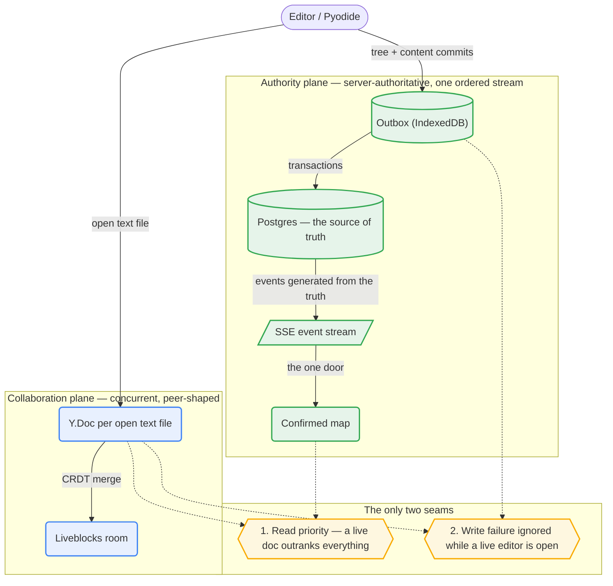
```mermaid
flowchart TD
    Editor(["Editor / Pyodide"])
    subgraph "Collaboration plane — concurrent, peer-shaped"
        YDoc("Y.Doc per open text file")
        Liveblocks("Liveblocks room")
        YDoc -->|CRDT merge| Liveblocks
    end
    subgraph "Authority plane — server-authoritative, one ordered stream"
        Outbox[("Outbox (IndexedDB)")]
        ConfirmedMap("Confirmed map")
        Postgres[("Postgres — the source of truth")]
        Stream[/"SSE event stream"/]
        Outbox -->|transactions| Postgres
        Postgres -->|events generated from the truth| Stream
        Stream -->|the one door| ConfirmedMap
    end
    Editor -->|open text file| YDoc
    Editor -->|tree + content commits| Outbox
    subgraph "The only two seams"
        ReadPriority{{"1. Read priority — a live doc outranks everything"}}
        WritePolicy{{"2. Write failure ignored while a live editor is open"}}
    end
    YDoc -.-> ReadPriority
    ConfirmedMap -.-> ReadPriority
    YDoc -.-> WritePolicy
    Outbox -.-> WritePolicy
    classDef collab fill:#e8f0fe,stroke:#4285f4,stroke-width:2px
    classDef authority fill:#e6f4ea,stroke:#34a853,stroke-width:2px
    classDef seam fill:#fef7e0,stroke:#f9ab00,stroke-width:2px
    class YDoc,Liveblocks collab
    class Outbox,ConfirmedMap,Postgres,Stream authority
    class ReadPriority,WritePolicy seam
```
<!-- /diagram -->

---


## 2. Vocabulary

**Entry** — a node in the tree: `{id, name, parent?, deleted?}` plus one
version token per property, type `file` or `folder`. Metadata is deliberately
*pure namespace*: it carries no content descriptor. **Client-minted ids**: the
client chooses an entry's id before it asks for the entry, which is what makes
creating one offline an ordinary queued transaction rather than a special case.

**Version** — an opaque token naming one state of *one property* of an entry:
its name, its parent, its deletion, or its content. Comparable by *equality
only*; it is a compare-and-swap (CAS) token, not a counter. There is no such
thing as a version of a whole entry — only four tokens that move independently.

A version token is the **id of the transaction that last set that property**.
The client minted that id, so it knows what token its own work will produce
before the response arrives — which is what lets it chain a whole session's
work offline with nothing remapped server-side. Splitting tokens by property
is what keeps that from over-firing: a collaborator's write moves the content
token and nothing else, so your pending rename still applies.

**Identity** — every id crossing the wire is client-minted with a platform
CSPRNG (UUIDv7 preferred). The server never remaps: an entry id already in use
is a typed refusal, because a remap would reintroduce the local-id → server-id
table that client-minted identity exists to delete.

**Content plane** — kind (`text` | `binary`), mime, size, hash. Revealed by
`Content` fetches, cached client-side per entry id, invalidated by stream
signals. Never present in entry metadata.

**Blob** — immutable bytes named by their sha256 hash. Content-addressing
gives dedup, integrity checking, free retry-idempotency, and "old versions
cost only distinct bytes."

**Transaction** — one client-initiated mutation, identified by
`${client}:${counter}`. Globally unique (client is a GUID), and
order-encoding (counter is strictly increasing per client).

**Client** — one browser tab's instance of the system, identified by a GUID
minted at page load. One client = one transaction counter = one outbox queue
= one sync loop.

**Session** — a GUID minted per page load, stamped on outbox entries and
drafts to distinguish "this session already rendered this optimistically"
from "survived a reload, definitely not reflected in the UI."

**Position** — the server-internal, per-workspace, monotonic stream position.
Orders the event stream and anchors tokens. *Never client-visible.*

**Token** — a single-use, ~60s-TTL credential minted by `Initialize`, bound
to `{user, workspace, position}`. Connecting the stream claims it atomically;
the stream replays events after its position before going live.

**Draft** — parked content with no server-side home: a `write` to a
now-deleted entry, plus a hash pointer to the bytes. Carries no version,
cannot conflict, lives outside the sync machinery. Down to this one case:
the offline-create draft is gone, because an offline create is now an
ordinary queued transaction.

<!-- diagram: Vocabulary -->
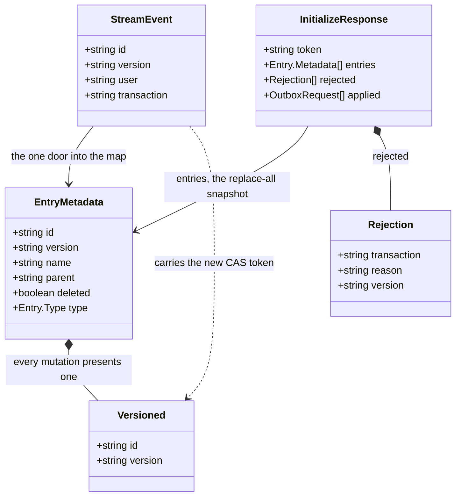
```mermaid
classDiagram
    class EntryMetadata {
        +string id
        +string version
        +string name
        +string parent
        +boolean deleted
        +Entry.Type type
    }
    class Versioned {
        +string id
        +string version
    }
    class StreamEvent {
        +string id
        +string version
        +string user
        +string transaction
    }
    class InitializeResponse {
        +string token
        +Entry.Metadata[] entries
        +Rejection[] rejected
        +OutboxRequest[] applied
    }
    class Rejection {
        +string transaction
        +string reason
        +string version
    }
    EntryMetadata *-- Versioned : every mutation presents one
    StreamEvent --> EntryMetadata : the one door into the map
    InitializeResponse --> EntryMetadata : entries, the replace-all snapshot
    InitializeResponse *-- Rejection : rejected
    StreamEvent ..> Versioned : carries the new CAS token
```
<!-- /diagram -->

---


## 3. System inventory

<!-- diagram: SystemInventory -->
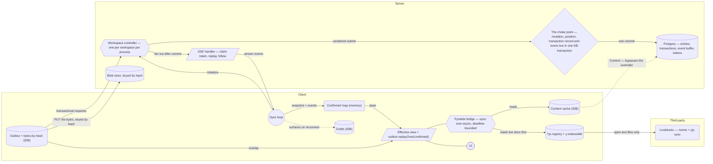
```mermaid
flowchart LR
    subgraph "Client"
        PyodideBridge{{"Pyodide bridge — sync-over-async, deadline-bounded"}}
        UI(["UI"])
        EffectiveView[/"Effective view = outbox.replayOver(confirmed)"/]
        ConfirmedMap("Confirmed map (memory)")
        Outbox[("Outbox + bytes-by-hash (IDB)")]
        ContentCache[("Content cache (IDB)")]
        DraftsStore[("Drafts (IDB)")]
        YjsRegistry[("Yjs registry + y-indexeddb")]
        SyncLoopDriver(("Sync loop"))
        ConfirmedMap -->|base| EffectiveView
        Outbox -->|overlay| EffectiveView
        EffectiveView --- UI
        EffectiveView --- PyodideBridge
        PyodideBridge -->|reads| ContentCache
        PyodideBridge -->|reads live docs first| YjsRegistry
        SyncLoopDriver -->|snapshot + events| ConfirmedMap
        SyncLoopDriver -.->|surfaces on reconnect| DraftsStore
    end
    subgraph "Server"
        Controller{{"Workspace controller — one per workspace per process"}}
        ChokePoint{"The choke point — mutation, position, transaction record and event row in one DB transaction"}
        Postgres[("Postgres — entries, transactions, event buffer, tokens")]
        SseHandler[/"SSE handler — claim token, replay, follow"/]
        BlobStore[("Blob store, keyed by hash")]
        Controller -->|serialized submit| ChokePoint
        ChokePoint -->|one commit| Postgres
        Controller -->|fan out after commit| SseHandler
    end
    subgraph "Third-party"
        Liveblocks("Liveblocks — rooms + yjs sync")
    end
    SyncLoopDriver -->|Initialize| Controller
    Outbox -->|transactional requests| Controller
    SseHandler -->|stream events| SyncLoopDriver
    ContentCache -.->|Content — bypasses the controller| Postgres
    Outbox -->|PUT the bytes, keyed by hash| BlobStore
    YjsRegistry -->|open text files only| Liveblocks
```
<!-- /diagram -->

### Client-side

**Confirmed map** (memory) — `Map<id, Entry.Metadata>`; the client's replica
of server truth. Mutated *only* by `Initialize` snapshots (replace-all) and
stream events. Never by request responses.

**Outbox** (IndexedDB) — the persistent queue of in-flight/offline
transactions, keyed `user → workspace → client → ordered list`. Plus a
content-addressed bytes store (hash → bytes) holding write/store payloads so
the queue itself stays rows-of-pointers.

**Effective view** (derived, never stored) —
`effective(id) = outbox.replayOver(confirmed)`. What the UI and the Pyodide
filesystem actually read. Optimistic updates are *derived*, not applied;
failure rollback is recomputation, not an operation.

**Content cache** (IndexedDB) — per-entry-id cache of `Content` responses
(bytes + kind/mime/size + version). Invalidated by `write`/`delete` stream
signals. Blob-kind bytes are additionally cacheable by hash, forever.

**Drafts store** (IndexedDB) — the parking lot (§5.3).

**Yjs doc registry** (memory + y-indexeddb) — refcounted `Y.Doc` +
Liveblocks room per *open* text file; "detach" means leave the room, never
forget unsynced work (teardown waits for flush).

**Sync loop** — one per client per workspace; the single driver of
Initialize → evict/replace → stream → backoff → repeat (§6.4).

**Pyodide bridge** — the sync-over-async seam: the worker's synchronous FS
calls are served by the main thread against the effective view + content
cache, with hard deadlines so a hung fetch can never wedge the
Atomics-blocked worker.

<!-- diagram: ClientStores -->
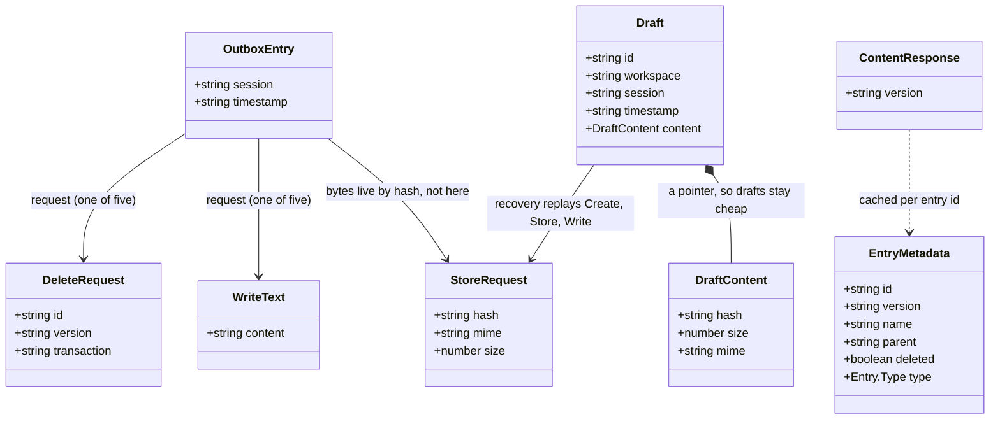
```mermaid
classDiagram
    class OutboxEntry {
        +string session
        +string timestamp
    }
    class DeleteRequest {
        +string id
        +string version
        +string transaction
    }
    class WriteText {
        +string content
    }
    class StoreRequest {
        +string hash
        +string mime
        +number size
    }
    class Draft {
        +string id
        +string workspace
        +string session
        +string timestamp
        +DraftContent content
    }
    class DraftContent {
        +string hash
        +number size
        +string mime
    }
    class ContentResponse {
        +string version
    }
    class EntryMetadata {
        +string id
        +string version
        +string name
        +string parent
        +boolean deleted
        +Entry.Type type
    }
    OutboxEntry --> DeleteRequest : request (one of five)
    OutboxEntry --> WriteText : request (one of five)
    OutboxEntry --> StoreRequest : bytes live by hash, not here
    Draft *-- DraftContent : a pointer, so drafts stay cheap
    Draft --> StoreRequest : recovery replays Create, Store, Write
    ContentResponse ..> EntryMetadata : cached per entry id
```
<!-- /diagram -->

### Server-side

**Postgres, tables of record** — an entry is pure identity, and each of its
four properties is an append-only log: names, parentage, deletions, content
(text as deltas, binary as hash pointers). Every row records the workspace
position it landed at, and current state is the newest row per log.

Four things that would ordinarily be separate tables are not:

- **No transaction record.** An applied transaction *is* the row it appended:
  its client-minted id is that row's primary key, so dedup is primary-key
  identity rather than a secondary index somebody has to remember to keep.
- **No refusal record.** Adjudication is a pure function of the workspace, so
  a refused transaction is recomputed rather than remembered — and the reason
  it produces is measured against the workspace as it stands, which is the one
  the client can act on. Nothing was applied, so there is nothing to store.
- **No event buffer.** One applied transaction takes exactly one position, so
  the rows of a workspace in position order *are* its event stream — and
  *which log* a row is in is which event it was. Nothing to retain, nothing to
  drift, and nothing to derive by comparing a row against its predecessor.
- **No version row.** A materialised "the entry looked like this" row would
  hold only what the four newest rows already say. Only a create writes more
  than one log at a position, which is what tells a birth from a change.

The one table beyond the domain schema is the **token table** —
`{token, user, workspace, position, expires}`, claimed by `DELETE ...
RETURNING` on stream connect.

**The choke point** — the one code path every mutation flows through, and by
now it is three lines: take the next position, stamp it onto the rows the
transaction appends, append them. One database transaction, serialized per
workspace by the controller. There is no event log to generate, because those
rows are it.

**Workspace controller + registry** — one controller per workspace per
process (the actor pattern). All writes — transactional requests AND
Initialize — flow through its serialized `submit()`, which fans committed
events out to subscribed streams after commit. Initialize's one-consistent-
view guarantee comes from this exclusion, not isolation levels. Reads
(Content, blobs) bypass it. Lifecycle: streams refcount it, mutations are
held for the duration of one (because they carry the position counter),
release is grace-delayed (~30s) so reconnect churn doesn't thrash it, and one
registry lock guards get-or-create AND release (re-checking the count inside
the lock) against the release/acquire race. Controller memory is
rebuildable-from-zero: Postgres remains the truth, and a controller taking a
workspace on reads its position out of the logs.

Nothing about a workspace is held open in the database — no lock, no
connection, no row. Live workspaces therefore cost the database nothing, and a
thousand of them cost exactly what one does.

**SSE handler** — claim token → subscribe → replay events after the token's
position → follow live, with comment heartbeats (~15s).

**Blob store** — object storage keyed by hash; `PUT /workspaces/{workspace}/blobs/{hash}` verifies
the hash and no-ops on duplicates.

<!-- diagram: ServerTables -->
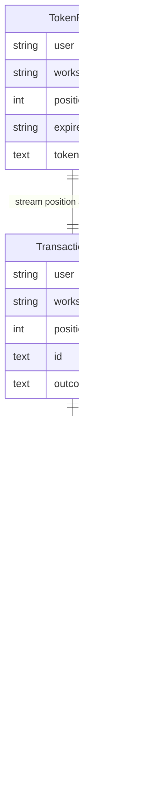
```mermaid
erDiagram
    TransactionRow ||--o{ EntryRow : "adjudicated against"
    TokenRow ||--|| TransactionRow : "stream position anchors after"
    EntryRow ||--o{ EntryRow : "parent of"

    TransactionRow {
        string user
        string workspace
        int position
        text id PK
        text outcome
    }
    EntryRow {
        string version
        string name
        boolean deleted
        text id PK
        text parent FK
        text type
    }
    TokenRow {
        string user
        string workspace
        int position
        string expires
        text token PK
    }
```
<!-- /diagram -->

### Third-party

**Liveblocks** — rooms, yjs sync protocol, presence — for open text files
only. Its footprint in the system is exactly the multi-writer surface.

---

## 4. State machines

### 4.1 Transaction lifecycle

| State | Meaning | Transitions out |
|---|---|---|
| **captured** | Persisted to outbox *before* the request is sent | → in-flight (sent) |
| **in-flight** | Sent, no response yet | → applied / rejected (response or stream echo or Initialize verdict); → captured (timeout: remains queued) |
| **applied** | Server committed it | → evicted (confirmed change and overlay removal cancel exactly; no flicker) |
| **rejected** | Typed failure | → evicted, routed to failure policy (§7); content-bearing rejections may also → draft |
| **evicted** | Removed from outbox | terminal |

Eviction triggers, any one suffices: response received; own transaction id
echoed on the stream; reported in `Initialize.applied`/`rejected`.

<!-- diagram: TransactionLifecycle -->
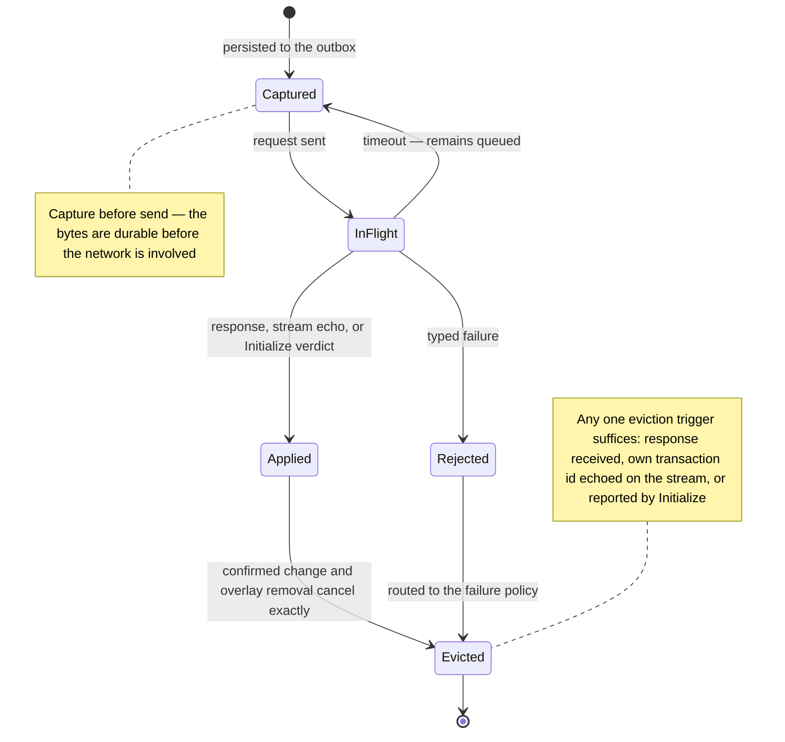
```mermaid
stateDiagram-v2
    [*] --> Captured : persisted to the outbox
    Captured --> InFlight : request sent
    InFlight --> Captured : timeout — remains queued
    InFlight --> Applied : response, stream echo, or Initialize verdict
    InFlight --> Rejected : typed failure
    Applied --> Evicted : confirmed change and overlay removal cancel exactly
    Rejected --> Evicted : routed to the failure policy
    Evicted --> [*]
    note right of Captured
        Capture before send — the bytes are durable before the network is involved
    end note
    note left of Evicted
        Any one eviction trigger suffices: response received, own transaction id echoed on the stream, or reported by Initialize
    end note
```
<!-- /diagram -->

### 4.2 Entry lifecycle

| State | Meaning | Transitions |
|---|---|---|
| **absent** | No such id | → live (Create; the client already holds the id, so the ack carries nothing — the entry enters the confirmed map only via the stream's `create` event) |
| **live** | In the tree | → live (rename / reparent / write, each advancing ONE property's token); → tombstoned (delete) |
| **tombstoned** | `deleted: true`; remains in snapshots | terminal (a "restore" is a fresh Create) |

Tombstones are load-bearing: reconciliation cannot distinguish "deleted"
from "unchanged" without them.

**Deleting a folder tombstones the folder, not its contents.** Its children
keep their `parent` pointers and are never touched, so there is a fourth state
the table above cannot show because it is not a state of the entry at all:
**unreachable** — live, present in every snapshot, and cut off from the root by
a tombstone somewhere above it. No event fires for those children, because
nothing about them changed.

**Computing reachability is the client's job, and it is not optional.** An
entry is reachable when every ancestor up to the root exists and none of them
is tombstoned; a client that renders `deleted !== true` alone draws entries
that are gone. It has to be recomputed after every `delete` and every
`parent`/`move` event, since either can sever or restore a whole subtree at
once. The server does exactly this walk — it is how a create into an
unreachable folder is refused — and it exposes no shortcut: a reachability
flag in a snapshot would go stale on the first event after it, which is worse
than not having one. See `Entry.Metadata.deleted` in the contract.

<!-- diagram: EntryLifecycle -->
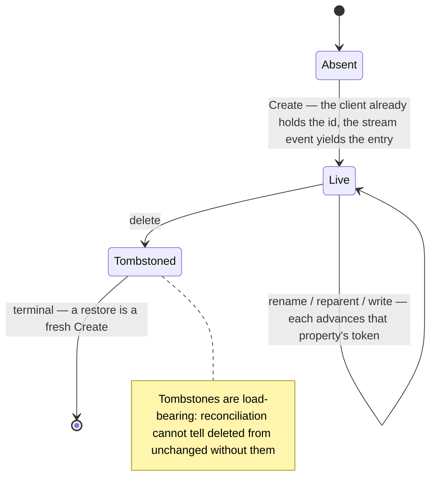
```mermaid
stateDiagram-v2
    [*] --> Absent
    Absent --> Live : Create — the client already holds the id, the stream event yields the entry
    Live --> Live : rename / reparent / write — each advances that property's token
    Live --> Tombstoned : delete
    Tombstoned --> [*] : terminal — a restore is a fresh Create
    note right of Tombstoned
        Tombstones are load-bearing: reconciliation cannot tell deleted from unchanged without them
    end note
```
<!-- /diagram -->

### 4.3 Draft lifecycle

| State | Meaning | Transitions |
|---|---|---|
| **parked** | Entry + hash pointer persisted (always *before* the error is raised to the caller) | → recovering (user accepts, online) / dismissed (explicit) |
| **recovering** | Minting a fresh entry id and replaying Create → Store → Write | → evicted (success) / parked (failure — never silently dropped) |
| **dismissed / evicted** | User chose, or recovery succeeded | terminal |

<!-- diagram: DraftLifecycle -->
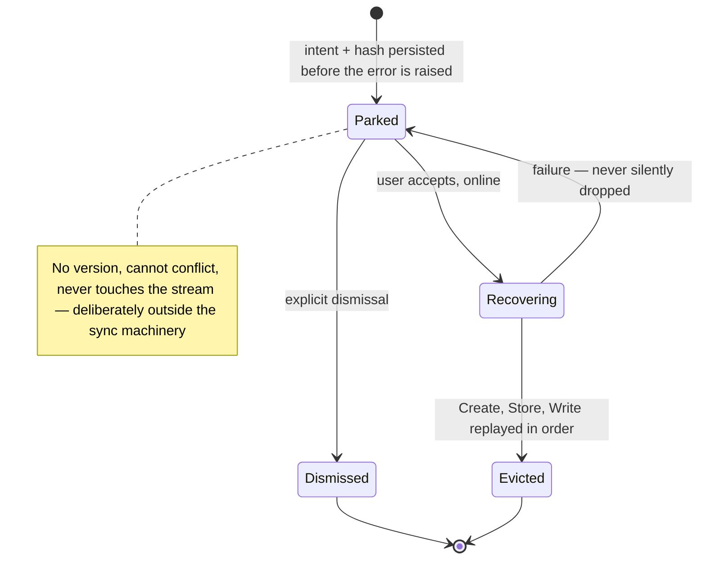
```mermaid
stateDiagram-v2
    [*] --> Parked : intent + hash persisted before the error is raised
    Parked --> Recovering : user accepts, online
    Parked --> Dismissed : explicit dismissal
    Recovering --> Parked : failure — never silently dropped
    Recovering --> Evicted : Create, Store, Write replayed in order
    Dismissed --> [*]
    Evicted --> [*]
    note right of Parked
        No version, cannot conflict, never touches the stream — deliberately outside the sync machinery
    end note
```
<!-- /diagram -->

### 4.4 Sync-loop connection states

| State | Meaning | Enters via | Leaves via |
|---|---|---|---|
| **cold** | No confirmed state | page load | cached (IDB tree loads) or live (Initialize succeeds) |
| **cached** | Serving last-known-good; possibly stale | stream failure, offline start | live (loop re-enters successfully) |
| **live** | Snapshot applied, stream established, heartbeats flowing | successful cycle | cached (error event or watchdog expiry) |
| **degraded** | Acks succeed but stream can't establish (proxy eats SSE) | watchdog + successful POSTs | live (stream recovers); loop degrades into polling meanwhile |

Cold start, reconnect, and recovery are the *same* path: every disruption
re-enters the loop at Initialize.

<!-- diagram: ConnectionStates -->
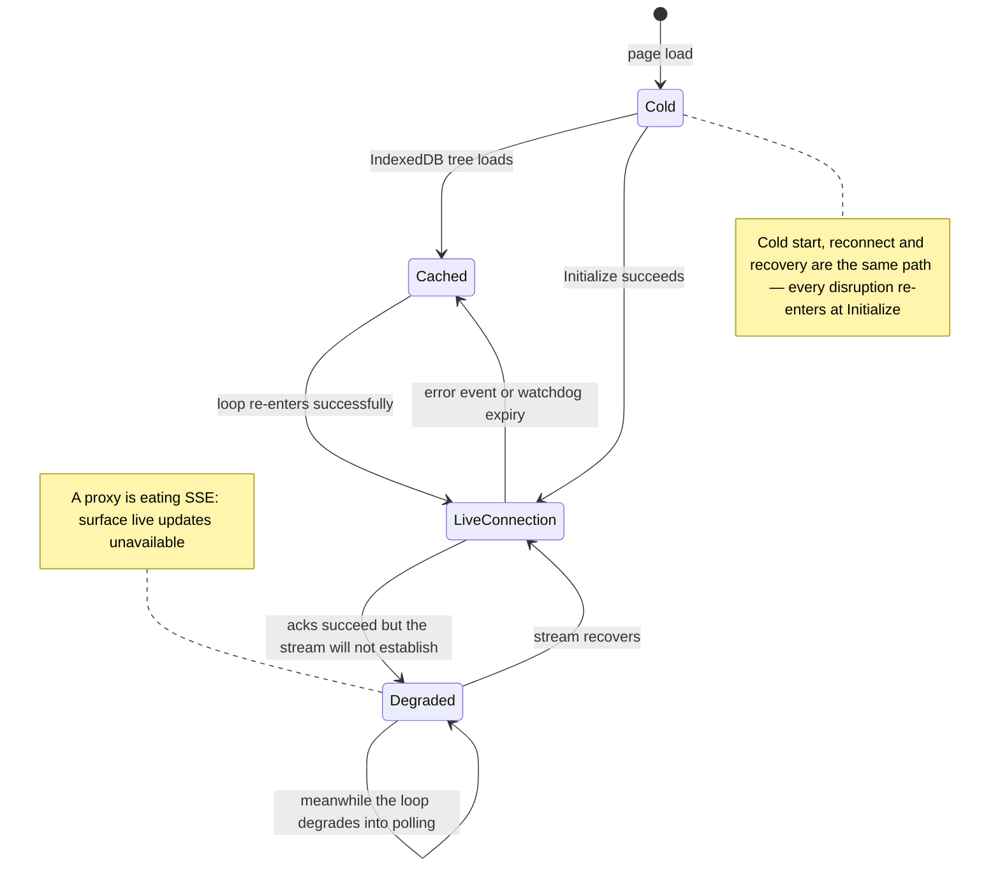
```mermaid
stateDiagram-v2
    [*] --> Cold : page load
    Cold --> Cached : IndexedDB tree loads
    Cold --> LiveConnection : Initialize succeeds
    Cached --> LiveConnection : loop re-enters successfully
    LiveConnection --> Cached : error event or watchdog expiry
    LiveConnection --> Degraded : acks succeed but the stream will not establish
    Degraded --> LiveConnection : stream recovers
    Degraded --> Degraded : meanwhile the loop degrades into polling
    note right of Cold
        Cold start, reconnect and recovery are the same path — every disruption re-enters at Initialize
    end note
    note left of Degraded
        A proxy is eating SSE: surface live updates unavailable
    end note
```
<!-- /diagram -->

### 4.5 Yjs doc lifecycle (per text file, per client)

closed → **attaching** (y-indexeddb loads first — instant local state — then
the room connects; CRDT merge reconciles) → **open** (refcounted) →
**flushing** (last reference released while unsynced changes exist: stay in
the room until the server has everything) → **closed** (local state kept as
warm cache) or **evicted** (file deleted: local state wiped, so stale CRDT
state can never resurrect).

<!-- diagram: YjsDocLifecycle -->
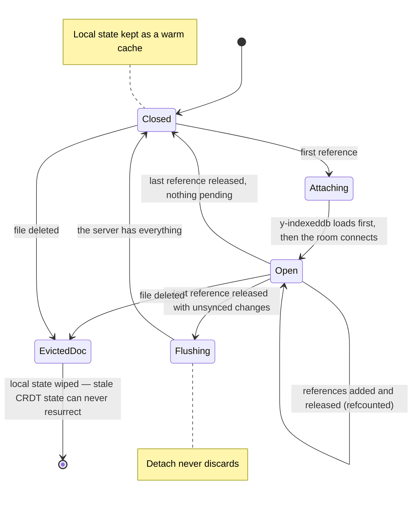
```mermaid
stateDiagram-v2
    [*] --> Closed
    Closed --> Attaching : first reference
    Attaching --> Open : y-indexeddb loads first, then the room connects
    Open --> Open : references added and released (refcounted)
    Open --> Flushing : last reference released with unsynced changes
    Flushing --> Closed : the server has everything
    Open --> Closed : last reference released, nothing pending
    Open --> EvictedDoc : file deleted
    Closed --> EvictedDoc : file deleted
    EvictedDoc --> [*] : local state wiped — stale CRDT state can never resurrect
    note right of Flushing
        Detach never discards
    end note
    note left of Closed
        Local state kept as a warm cache
    end note
```
<!-- /diagram -->

---

## 5. Content model

Content is per-version and typed at write time: a `Write` is `text`
(inline string) or `binary` (hash + size + mime, bytes previously `Store`d).
A write of the other type *is* the kind transition — there is no separate
transition machinery in this design; the next `Content` fetch reveals the
new kind and the client re-routes accordingly.

Reads route on the *cached* kind; the `write` stream signal invalidates both
content and kind, so a stale route self-corrects on the next fetch. Offline
with a cold cache, kind is honestly UNKNOWN and the UI says so.

Live-editability is a client-side determination (text kind + within size
budget + editor opened), not a server-side state.

<!-- diagram: ContentModel -->
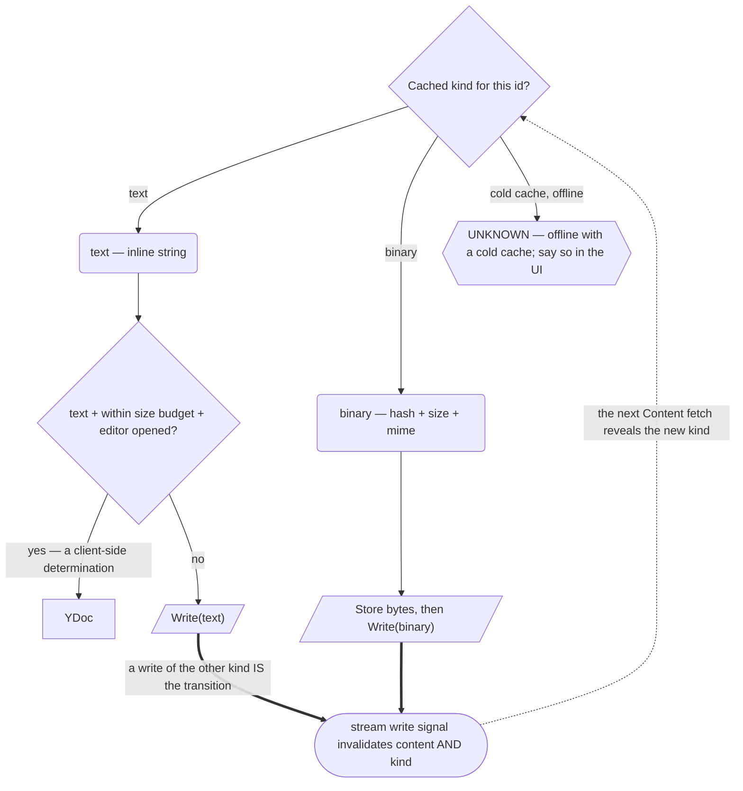
```mermaid
flowchart TD
    CachedKind{"Cached kind for this id?"}
    TextRoute("text — inline string")
    BinaryRoute("binary — hash + size + mime")
    UnknownKind{{"UNKNOWN — offline with a cold cache; say so in the UI"}}
    LiveEditable{"text + within size budget + editor opened?"}
    WriteAsText[/"Write(text)"/]
    WriteAsBinary[/"Store bytes, then Write(binary)"/]
    Invalidate(["stream write signal invalidates content AND kind"])
    CachedKind -->|text| TextRoute
    CachedKind -->|binary| BinaryRoute
    CachedKind -->|cold cache, offline| UnknownKind
    TextRoute --> LiveEditable
    LiveEditable -->|yes — a client-side determination| YDoc
    LiveEditable -->|no| WriteAsText
    BinaryRoute --> WriteAsBinary
    WriteAsText ==>|a write of the other kind IS the transition| Invalidate
    WriteAsBinary ==> Invalidate
    Invalidate -.->|the next Content fetch reveals the new kind| CachedKind
```
<!-- /diagram -->

---

## 6. Data flows

<!-- diagram: RequestSurface -->
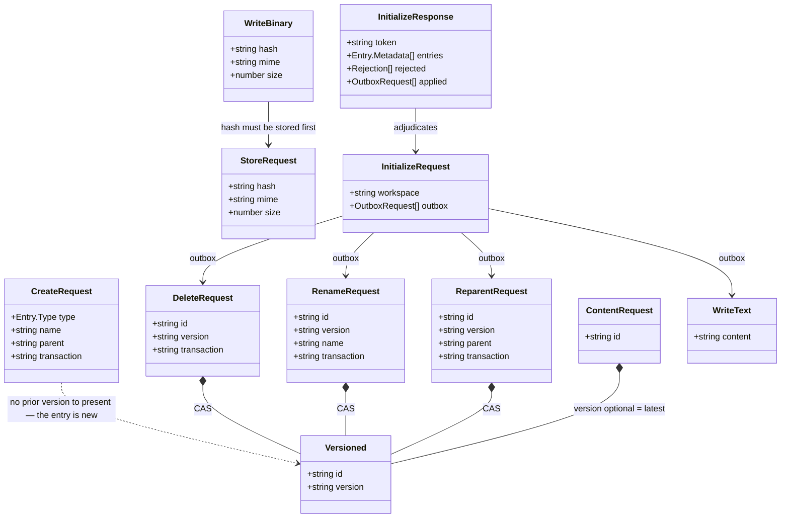
```mermaid
classDiagram
    class CreateRequest {
        +Entry.Type type
        +string name
        +string parent
        +string transaction
    }
    class Versioned {
        +string id
        +string version
    }
    class DeleteRequest {
        +string id
        +string version
        +string transaction
    }
    class RenameRequest {
        +string id
        +string version
        +string name
        +string transaction
    }
    class ReparentRequest {
        +string id
        +string version
        +string parent
        +string transaction
    }
    class ContentRequest {
        +string id
    }
    class StoreRequest {
        +string hash
        +string mime
        +number size
    }
    class WriteText {
        +string content
    }
    class WriteBinary {
        +string hash
        +string mime
        +number size
    }
    class InitializeRequest {
        +string workspace
        +OutboxRequest[] outbox
    }
    class InitializeResponse {
        +string token
        +Entry.Metadata[] entries
        +Rejection[] rejected
        +OutboxRequest[] applied
    }
    CreateRequest ..> Versioned : no prior version to present — the entry is new
    DeleteRequest *-- Versioned : CAS
    RenameRequest *-- Versioned : CAS
    ReparentRequest *-- Versioned : CAS
    ContentRequest *-- Versioned : version optional = latest
    WriteBinary --> StoreRequest : hash must be stored first
    InitializeRequest --> DeleteRequest : outbox
    InitializeRequest --> RenameRequest : outbox
    InitializeRequest --> ReparentRequest : outbox
    InitializeRequest --> WriteText : outbox
    InitializeResponse --> InitializeRequest : adjudicates
```
<!-- /diagram -->

### 6.1 Read (`readFile`, called by the Pyodide bridge or a viewer)

1. Live yjs doc open for this file on this client → serve the doc.
2. Content open in an *active* non-yjs editor (visible/dirty this session,
   not merely mounted) → serve that buffer.
3. Content cache hit for this id → serve it.
4. Fetch `Content` (deadline-bounded), populate cache, serve.
5. Offline/failed → clean filesystem error through the bridge. Never a hang.

<!-- diagram: ReadFlow -->
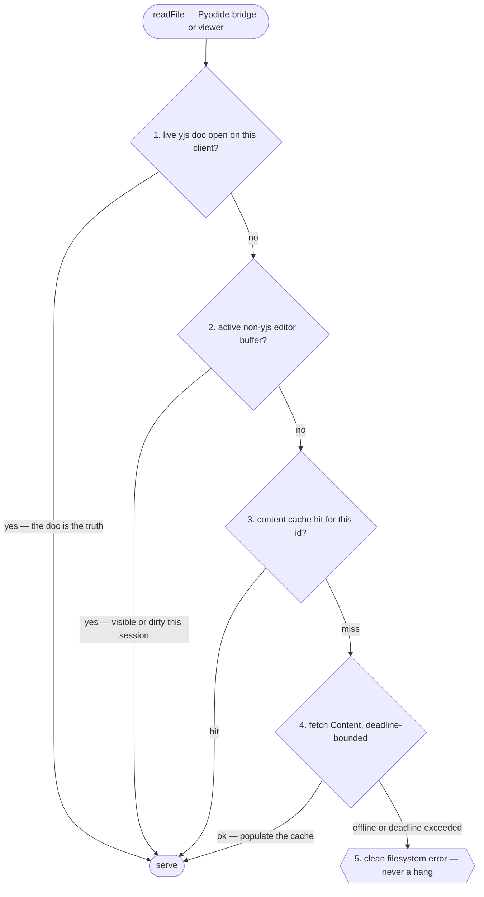
```mermaid
flowchart TD
    PyodideBridge(["readFile — Pyodide bridge or viewer"])
    YDoc{"1. live yjs doc open on this client?"}
    ActiveBuffer{"2. active non-yjs editor buffer?"}
    ContentCache{"3. content cache hit for this id?"}
    ContentFetch{"4. fetch Content, deadline-bounded"}
    Serve(["serve"])
    FsError{{"5. clean filesystem error — never a hang"}}
    PyodideBridge --> YDoc
    YDoc -->|yes — the doc is the truth| Serve
    YDoc -->|no| ActiveBuffer
    ActiveBuffer -->|yes — visible or dirty this session| Serve
    ActiveBuffer -->|no| ContentCache
    ContentCache -->|hit| Serve
    ContentCache -->|miss| ContentFetch
    ContentFetch -->|ok — populate the cache| Serve
    ContentFetch -->|offline or deadline exceeded| FsError
```
<!-- /diagram -->

### 6.2 Write (`writeFile`)

Route on cached kind. Text + live doc → apply as a minimal yjs diff (one
delete + one insert around the common prefix/suffix) so concurrent human
edits merge instead of being clobbered. Otherwise → capture transaction to
outbox → (binary: `Store` bytes by hash first) → submit `Write` with the
entry's current version (CAS). Failure routes per §7.

<!-- diagram: WriteFlow -->
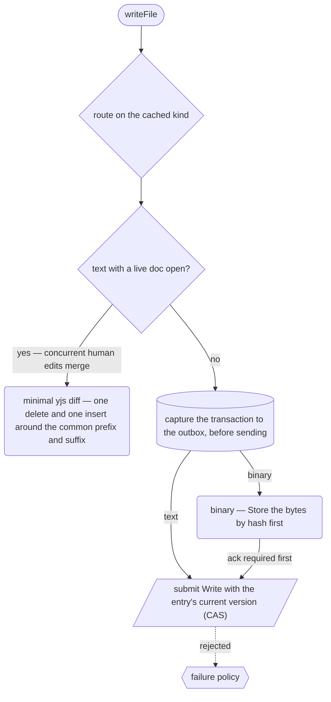
```mermaid
flowchart TD
    WriteCall(["writeFile"])
    CachedKind{"route on the cached kind"}
    YDoc{"text with a live doc open?"}
    YjsDiff("minimal yjs diff — one delete and one insert around the common prefix and suffix")
    Capture[("capture the transaction to the outbox, before sending")]
    StoreBytes("binary — Store the bytes by hash first")
    SubmitWrite[/"submit Write with the entry's current version (CAS)"/]
    FailurePolicy{{"failure policy"}}
    WriteCall --> CachedKind
    CachedKind --> YDoc
    YDoc -->|yes — concurrent human edits merge| YjsDiff
    YDoc -->|no| Capture
    Capture -->|binary| StoreBytes
    Capture -->|text| SubmitWrite
    StoreBytes -->|ack required first| SubmitWrite
    SubmitWrite -.->|rejected| FailurePolicy
```
<!-- /diagram -->

### 6.3 Create

Mint an entry id and a transaction id → queue the request like any other →
dependent operations may proceed against that id immediately, online or off →
the stream's `create` event populates the confirmed map. A lost ack is retried
with the *same* transaction id and the *same* entry id; the server answers from
the row it already appended rather than minting a second entry.

A create carries the entry's content: a file is born with it, a folder is born
without, and neither is optional — an "empty file" is something a client says
rather than something it omits. So an entry never exists in a contentless
state, every Write has a real token to present, and a Pyodide computation
finishing offline is one queued transaction instead of two.

The typical gesture is "new file, then type its name", so the client sends a
placeholder name and opens the name field for editing straight away — blank,
VSCode-style. Filling it issues a rename; leaving it blank issues a delete.
Both name the entry by the id the client minted, whether or not the create has
been acknowledged yet.

A name collision on create is **renamed, not refused**: a create has no prior
version to compare against, so refusing it would be the only thing standing
between two offline clients and a lost `notes.md`. The create lands under the
name it asked for and the controller renames it — two events, a `create` then
a `name`, both arriving through the one door. A rename IS refused on
collision: there the user typed a specific name and deserves to be told.

**Names settle at the end of the unit of work, not at the create.** One
controller submission is one database transaction, so for a single online
create that is immediately afterwards — but for a replayed outbox it is after
every queued transaction has had its say. That matters for the ordinary
offline gesture: create `notes.md`, then type `report.md` over it. By the time
names settle the entry is called `report.md`, nothing collides, and the
controller issues no rename at all. The typed name simply wins.

Two consequences worth knowing. First claim wins: when two entries do arrive
holding one name, the one whose name row is older keeps it. And within a
replay two live siblings may briefly share a name — which is never observable
as a wrong answer, because a create only settles away from its name when
somebody claimed that name first, and that earlier claimant still holds it
afterwards.

<!-- diagram: CreateFlow -->
```mermaid
sequenceDiagram
    actor Caller as Caller (UI or Pyodide)
    participant OutboxQueue as Outbox
    participant ServerSide as Server
    participant ConfirmedMap as Confirmed map
    Note over Caller,ConfirmedMap: The client mints the entry id, so a create is queued like anything else — online or off
    Caller->>Caller: mint entry id + transaction id
    Caller->>OutboxQueue: capture before send
    Caller->>+ServerSide: Create(transaction, id, type, name?, parent?)
    ServerSide-->>-Caller: ack — carries nothing; the id was never the server's to give
    Note right of Caller: Dependent work referenced that id from the moment it was minted
    ServerSide-)ConfirmedMap: stream create event — the entry enters the map here, and only here
    opt ack lost
        Caller->>ServerSide: retry with the SAME transaction id and entry id
        ServerSide-->>Caller: answered from the row already appended — never a second entry
    end
```
<!-- /diagram -->

### 6.4 The sync loop

```
loop:
  POST Initialize(workspace, outbox transaction ids)
    → server, in ONE repeatable-read transaction: adjudicate outbox in
      order (unseen ones applied now), snapshot entries, read position,
      mint token
  evict applied/rejected; replace confirmed map   // same server tx → no gap, no flicker
  connect EventSource with token                   // single-use; claims atomically
    → server replays events after token.position, then follows live
  consume events until error / watchdog expiry
  jittered exponential backoff (reset only on an established stream); re-enter
```

Never rely on EventSource auto-reconnect (it replays a spent token). Also
re-enter on `visibilitychange`-to-visible and `online` — Initialize with an
empty outbox is a cheap no-op.

<!-- diagram: SyncLoopFlow -->
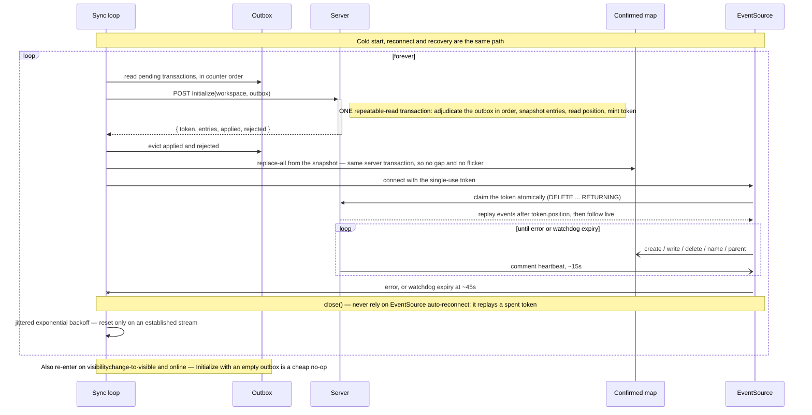
```mermaid
sequenceDiagram
    participant SyncLoop as Sync loop
    participant Outbox as Outbox
    participant ServerSide as Server
    participant ConfirmedMap as Confirmed map
    participant EventStream as EventSource
    Note over SyncLoop,EventStream: Cold start, reconnect and recovery are the same path
    loop forever
        SyncLoop->>Outbox: read pending transactions, in counter order
        SyncLoop->>+ServerSide: POST Initialize(workspace, outbox)
        Note right of ServerSide: ONE repeatable-read transaction: adjudicate the outbox in order, snapshot entries, read position, mint token
        ServerSide-->>-SyncLoop: { token, entries, applied, rejected }
        SyncLoop->>Outbox: evict applied and rejected
        SyncLoop->>ConfirmedMap: replace-all from the snapshot — same server transaction, so no gap and no flicker
        SyncLoop->>+EventStream: connect with the single-use token
        EventStream->>ServerSide: claim the token atomically (DELETE ... RETURNING)
        ServerSide-->>EventStream: replay events after token.position, then follow live
        loop until error or watchdog expiry
            EventStream-)ConfirmedMap: create / write / delete / name / parent
            ServerSide-)EventStream: comment heartbeat, ~15s
        end
        EventStream-xSyncLoop: error, or watchdog expiry at ~45s
        Note over SyncLoop,EventStream: close() — never rely on EventSource auto-reconnect: it replays a spent token
        SyncLoop->>SyncLoop: jittered exponential backoff — reset only on an established stream
    end
    Note over SyncLoop,Outbox: Also re-enter on visibilitychange-to-visible and online — Initialize with an empty outbox is a cheap no-op
```
<!-- /diagram -->

### 6.5 Blob transfer

Upload: `PUT /workspaces/{workspace}/blobs/{hash}` with raw bytes; server verifies sha256; duplicate
hash → immediate ack (retry-safe by construction). Download: raw bytes with
`Content-Type` and `ETag: {version}` (or redirect to object storage).

<!-- diagram: BlobTransfer -->
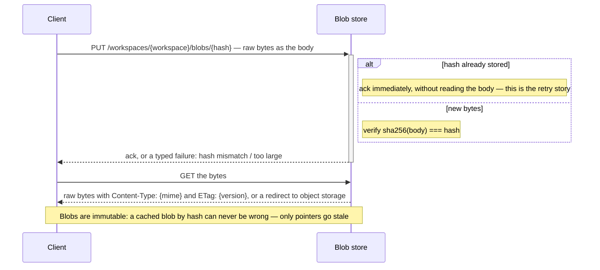
```mermaid
sequenceDiagram
    participant ClientSide as Client
    participant Blobs as Blob store
    ClientSide->>+Blobs: PUT /workspaces/{workspace}/blobs/{hash} — raw bytes as the body
    alt hash already stored
        Note right of Blobs: ack immediately, without reading the body — this is the retry story
    else new bytes
        Note right of Blobs: verify sha256(body) === hash
    end
    Blobs-->>-ClientSide: ack, or a typed failure: hash mismatch / too large
    ClientSide->>Blobs: GET the bytes
    Blobs-->>ClientSide: raw bytes with Content-Type: {mime} and ETag: {version}, or a redirect to object storage
    Note over ClientSide,Blobs: Blobs are immutable: a cached blob by hash can never be wrong — only pointers go stale
```
<!-- /diagram -->

---

## 7. Failure policy (client's decision, by design)

| Failure | Policy |
|---|---|
| Content write conflict, live editor open | Ignore — the yjs doc is the truth; all text mutations flow through it |
| Text write conflict, no live editor | Diff editor: fetch `Content` at the conflicting version for the other side |
| Write to a deleted entry | Evict transaction; park content as a draft |
| Create offline | Queue it — the id is the client's to mint. Nothing to park, nothing to disable |
| Move / rename / delete rejected | Evict; effective view snaps back automatically |
| Store hash mismatch / too large | Surface; do not retry blindly (the bytes are wrong or oversized, not the network) |
| Content fetch offline, cold cache | Clean filesystem error (deadline-bounded), never a wedge |

<!-- diagram: FailurePolicyRouting -->
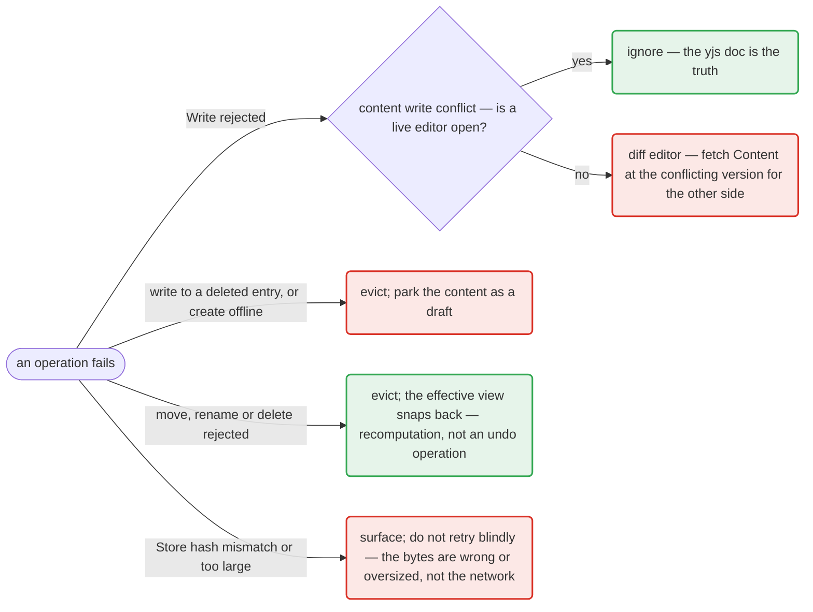
```mermaid
flowchart LR
    Failure(["an operation fails"])
    LiveEditorOpen{"content write conflict — is a live editor open?"}
    IgnoreIt("ignore — the yjs doc is the truth")
    DiffEditor("diff editor — fetch Content at the conflicting version for the other side")
    ParkDraft("evict; park the content as a draft")
    SnapBack("evict; the effective view snaps back — recomputation, not an undo operation")
    SurfaceIt("surface; do not retry blindly — the bytes are wrong or oversized, not the network")
    Failure -->|Write rejected| LiveEditorOpen
    LiveEditorOpen -->|yes| IgnoreIt
    LiveEditorOpen -->|no| DiffEditor
    Failure -->|write to a deleted entry, or create offline| ParkDraft
    Failure -->|move, rename or delete rejected| SnapBack
    Failure -->|Store hash mismatch or too large| SurfaceIt
    classDef quiet fill:#e6f4ea,stroke:#34a853,stroke-width:2px
    classDef loud fill:#fce8e6,stroke:#d93025,stroke-width:2px
    class IgnoreIt,SnapBack quiet
    class DiffEditor,ParkDraft,SurfaceIt loud
```
<!-- /diagram -->

---

## 8. Invariants — the rules that must never be broken

1. **One door for state.** The confirmed map changes only via Initialize
   snapshots and stream events. Responses only adjudicate the outbox. The
   There is no exception: a create's id came from the client, so an ack
   has nothing to add.
2. **Initialize is one database transaction.** Adjudication, snapshot, and
   token position together, or the no-flicker/no-gap guarantees silently die.
   Do not let anyone "optimize" it apart.
3. **Event log generated from the truth.** Position bump, mutation,
   transaction record, and event row commit atomically at the choke point.
   There is no publish step that can fail independently.
4. **Capture before send; park before raise.** A transaction is persisted to
   the outbox before its request is sent; a draft is persisted before the
   error is returned to the caller. Ordering is what saves the bytes.
5. **Order is sacred in the outbox.** Counter order in, counter order out;
   coalescing is per-entry, writes-only, boring, and unit-tested.
6. **Versions are equality-only, per-property CAS tokens.** No client-side
   "newer than" reasoning exists; staleness is resolved by re-entering the
   loop. A token that was never issued at all is a *different class* of
   failure from a stale one — it means the client's state is unsound, and the
   only sound response is to discard it and re-Initialize.
7. **Detach never discards.** A yjs doc with unsynced changes stays attached
   in the background until flushed; eviction (deletion) is the only path
   that wipes, and it always wipes.
8. **Deadlines everywhere the worker blocks.** A hung network call surfaces
   as a filesystem error; the Atomics-blocked kernel never wedges.
9. **Conflicts are never silent.** Rejected work is surfaced (diff, snap-back,
   draft); concurrent blob commits fail CAS rather than last-write-wins.
10. **Blobs are immutable; hashes are forever.** A cached blob by hash can
    never be wrong — only pointers go stale.
11. **One process serves a deployment.** "One controller per workspace" is
    only true within a process, and positions are counted in that process's
    memory — so a second process serving the same workspace hands out numbers
    the first has already used. This is the first invariant a deployment
    engineer can violate without touching code (`--workers 4`, an
    autoscaler's max-instances > 1).

    **Nothing in the code enforces it.** There is one guard, and it is
    partial: the startup check reads `WEB_CONCURRENCY`, which is where the
    mistake usually lives but not always — `WEB_CONCURRENCY` is only uvicorn's
    default for `--workers`, so an explicit `--workers 4` sets nothing there
    and starts four processes anyway. Running one instance is the operator's
    promise, deliberately, and this is what it buys: the database holds no
    lock, no lease and no connection on any workspace's behalf, so a live
    workspace costs nothing to keep and their number is bounded by memory
    rather than by `max_connections`.

    What breaking it costs: two processes each counting positions from their
    own reading of the logs, handing out the same numbers. Because events are
    grouped by the transaction that wrote them rather than by position, the
    result is a stream that is out of order rather than one that means the
    wrong thing — but it is still wrong, and nothing will say so.

    Making it the database's promise means a lease table with a heartbeat, not
    a held lock: a held advisory lock costs one postgres backend per live
    workspace, which is the ceiling this design exists to avoid. That, and a
    cross-process bus behind the controllers, is the upgrade path when scale
    demands it.

---

## 9. The honest accounting

| Concern | Count |
|---|---|
| Request types | 7 (Create, Delete, Rename, Reparent, Store, Write, Content) + Initialize |
| Stream event types | 5 (create, write, delete, name, parent) |
| Client loops | 1 per client per workspace |
| Server tables beyond the domain schema | 1 (stream tokens) |
| Client persistent stores | 4 (outbox + bytes-by-hash, content cache, drafts, y-indexeddb per open doc) |
| Derived client state | 2 (confirmed map, effective view) |
| Third-party dependencies in the sync core | 0 (Liveblocks serves only the collaboration plane) |
| Seams between the two planes | 2 (read-flow priority; live-editor write policy) |

Everything in the sync core survives the subtraction test: remove any piece
and a named goal breaks (outbox → lost work; CAS → silently destroyed
collaborators' work; one-door → response/stream races; Initialize → stranded
outboxes; token position → silent stream gaps; drafts → a write whose entry
was deleted underneath it loses its bytes).

## 10. Deliberately not built (yet)

- **Multi-tab leader election.** Multiple tabs are *correct* today (one
  client each, converging via the stream, server dedup by transaction id) —
  just wasteful. Web Locks election + BroadcastChannel fan-out is a
  contained optimization. Orphaned outbox queues are already adoptable.
- **A precise definition of "active" for non-yjs editor buffers** — a
  product decision (visible? dirty? this session?) pending real UX.
- **Stream resume via cursor.** The single-use-token design makes every
  reconnect a fresh snapshot. If resnapshot-per-blip ever gets expensive
  (mobile), a resume cursor can be added server-side without breaking this
  contract.
- **Kind-transition automation** (size-based demotion of huge text files
  from live editability) — the content model (§5) already accommodates it;
  the trigger machinery can come later.
- **Restore.** A tombstone is terminal, and a "restore" is a fresh Create.
  Nobody should add it as "just a CAS write to `deleted`": the parent may have
  been deleted since, and the name may have been taken while the entry was
  gone, so a restore would have to re-run every create-time check. Until it
  does, it does not exist.
- **Case-insensitive names.** Sibling uniqueness is case-SENSITIVE, matching
  the Linux-shaped runtime that reads the tree, where `Foo.py` and `foo.py`
  are two importable modules. Names are NFC-normalised at the controller, so
  a macOS client's `café` and a Linux client's `café` are one name. Reversing
  the case decision later means reconciling workspaces that already hold
  colliding pairs.

The design is at the stage where the threat is no longer a flaw in it, but
feature pressure gradually un-simplifying it. Each addition should be asked
the same question this document answers: which goal breaks without you?
